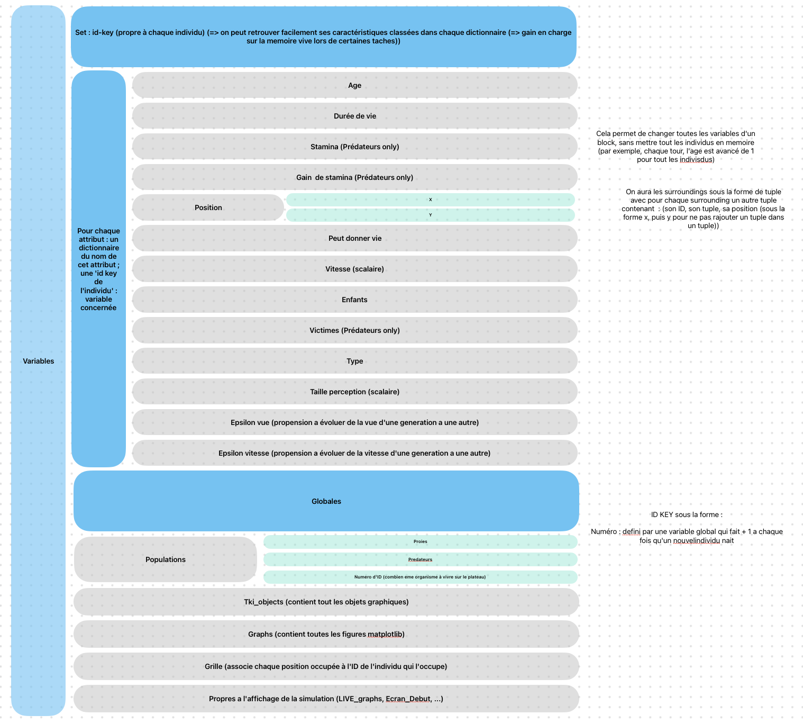

# Simulation de l'environement

    Simulation de l'evolution de`Proies` (Lapins) et de `Predateurs` (Renards) dans un environement clos et avec une evolution genetique possible entre chqaue generation.

Le but étant d'observer le comportement et l'evolution theorique de deux populations lorsque l'une peur réapparaite et se reproduire à l'infini sans autre contrainte que sa duree de vie, et l'autre est un superpredateur et doit pour survivre et se reprosuire chasser des individus de la premiere espece.

## Pour commencer

### Pré-requis

* Le dossier *tkiteasy* version 4.72
* *matplotlib*
* *PIL*
* *Random*
* *time*
* *os*
* Un dossier *Data* contenant l'image *Bc.jpg* (recommandé ; sinon le programme crée le dossier et passe en background par default)
* *python 3.11* or above (recomendé)

### Installation

Telecharger le fichier zip

Verifier que votre environement ou votre venv contient les prerequis

## Démarrage

Excecuter le programme depuis le fichier `sim.py` pour commencer.

Observer les graphs sur la derniere fenetre et/ou dans le dossier `Data`

## Fabriqué avec

Programmes/Logiciels/Ressources utilisés pour développer le projet :

* [VS code](https://code.visualstudio.com/) - Editeur de texte

## Versions

Listez les versions ici *exemple :* **Dernière version stable :** 4.8 **Dernière version :** 4.8

## Auteurs

Liste des auteurs du projet :

* Antoine
* Arthur

## Travail accompli

### Structure:

* Dictionnaires : (pour stocker les variables, objets tkiteasy, graphs matplotlib, variables relatives à un individu) permet de ne pas surcharger la machine en lui faisant charger des information inutiles (ex : avec une classe en changeant la duree de vie d'un individu on charge aussi toutes ses autres variables, ici on ne charge que le dictionnaire "duree de vie")
* tuples : pour stocker de l'information (historique des tours, position x et y)
* booléens : pour les mechanismes de ssession (ex : les predateurs ont-ils-besoins d'etre en couple pour se reproduire ?)

### Deroulé d'un tour:

1. On verifie pour chaque individu si il peut enfanter selon ses contraintes
2. On permet a chque individu d'effectuer 2 actions:
   1. Enfanter si il le peut et que les conditions sont réunies (ex : une autre proie en acapacité d'enfanté et a portée de deplacement)
   2. Bouger dans un rayon defini par la valeur de la `vitesse` de l'individu
3. Ajouter tout les nouveaux organismes au plateau (pas fait en cours de tour car on ne peut editer un dictionaire lorsque l'on est entrain d'en exploiter les clefs)
4. Enlever les morts (pas fait en cours de tour car on ne peut editer un dictionaire lorsque l'on est entrain d'en exploiter les clefs)
5. Modifier les informations relatives au tour (Graphiques live, nombre de proies, ...) qui apparaissent a droite du plateau (si activé).

## Problemes rencontrés

* Passer d'une grille 2D a une version avec dictionnaire
* Passer d'un format en grille à un espace vectoriel de dimension 2 fonctionnant par coordonnées (x, y) pour une visualisation plus réaliste
* Afficher dans la fenetre tkiteasy des graphiques matplitlib générés en live
* Qualibrer les differentes evolutions pour qu'elles apparaissent a la bonne taille de fenêtre
* Optimiser le deroulement d'un tour afin de liberer du temps de calcul pour l'affichage des graphs en live et/ou pour la gestion de plus d'organismes
* Passer d'une version dictionnaire à un fichier contenant une Classe
* Gestion des caracteristiques des individus selon le resize de fenetre
* Compatibilité de la simulation sur Windows et OS
* En cas de faible concentration, l'optimisation de recherche de renard se retourne contre nous et le programme est plus lent quand il y a peu de rpoies car les renards testent tout leurs alentours (en cours de reglage dans la version 4.9 avec un systeme de recherche adaptatif)

## Bugs Connus

* Sur une definition de plateau extremement petite, Il est impossible de distinguer les lapins des renards. (car leur affichage est donné par un rond de diametre 6 pixels)
* En cas de forte concentration, 1 predateur affiché en dehors de la ligne

## Idées originales

* Ameliorations aesthetiques (Background, Bordures, ...)
* Graphiques directement integrés dans la fenetre graphique
* Fenetre de debut pour expliquer les paramettres et les individus presents dan sla simulation
* Fenetre de fin qui recapitule le deroulé de la simulation à l'aide de graphs matplotlib
* Indications et `Live_graps` d'evolution des populations en live durant le deroulement de la simulation
* Un fichier contenant la classe de la simulation et donc facilement réutilisable dans d'autres projets
* La possibilité d'activer une option pour obliger les predateurs à être en couple pour se reproduire (ajustements à venir dans les versiosn futures)
* Evolution genetique des individus selon leur parent et un facteur `Epsilon` defini au debut de la simulation pour chaque caracteristique ({vue des predateurs, vitesse des predateurs, vue des proies, vitesse des proies})
* Espace vectoriel 2D permettant des deplacement dans une zone circulaire
* Pour garder trace et/ou relancer une simulation, ajout d'une `random_seed`
* Algorithme reccursif optimisé pour repperer le lapin le plus proche
